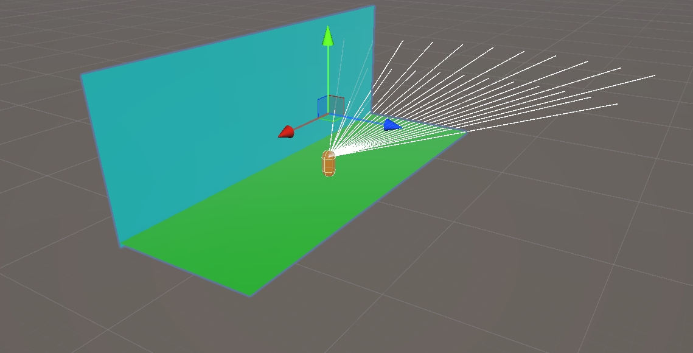
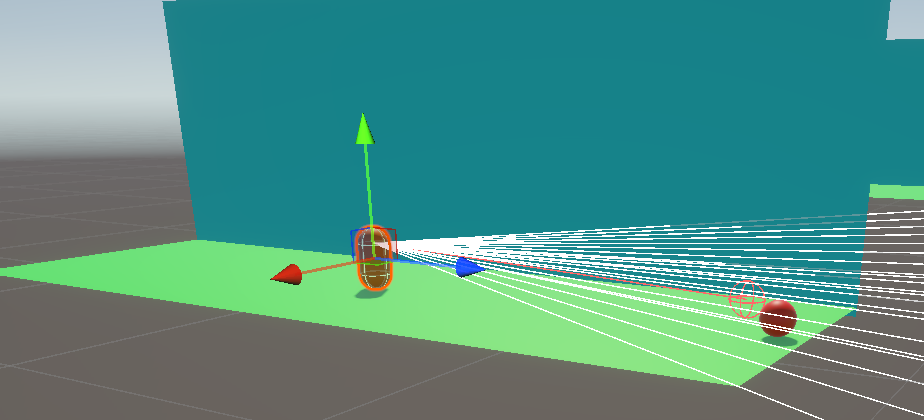
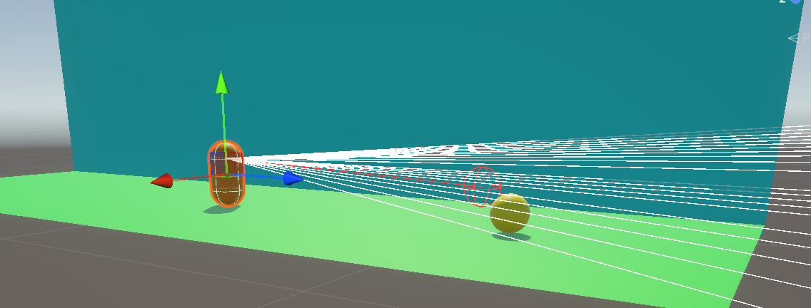
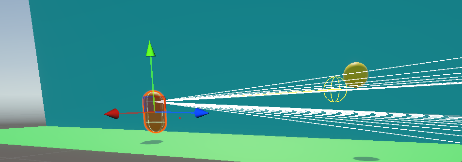
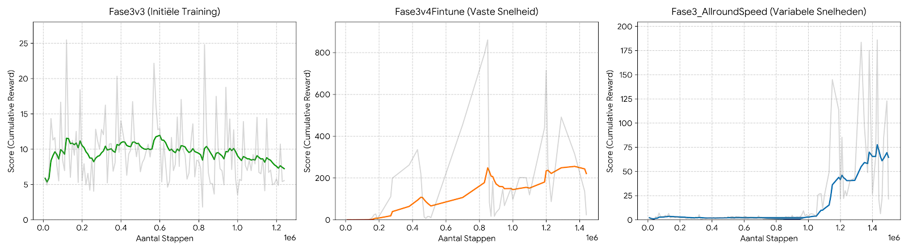
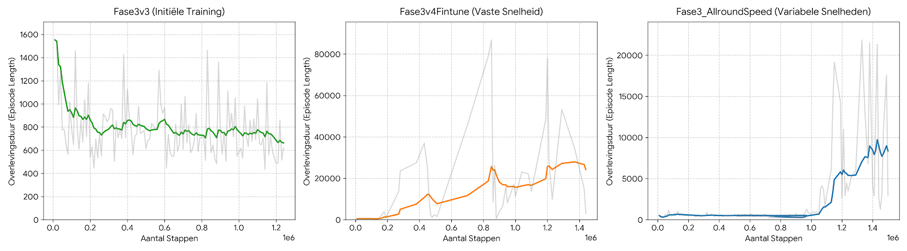
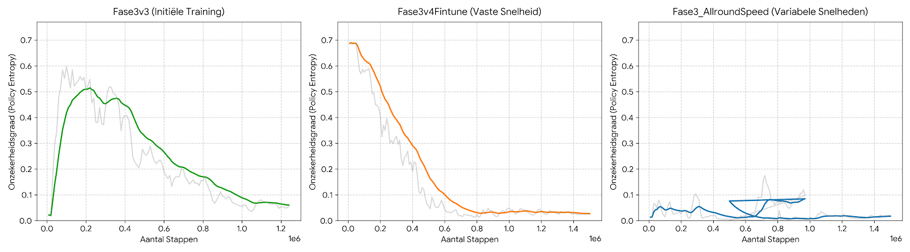

# Technisch Rapport: Ontwikkeling en Training van een ML-Agent in een Dynamische 3D-Platformer

## Inleiding

Dit rapport documenteert de ontwikkeling, training en evaluatie van een Reinforcement Learning agent in een ontwikkelde Unity 3D-platformer omgeving. Het doel van dit onderzoek is het analyseren van het leerproces van een agent wanneer deze wordt blootgesteld aan variabele snelheden en obstakelconfiguraties. Hierbij wordt de capaciteit voor generalisatie afgewogen tegen de risico's van overfitting. De inhoud is primair bedoeld voor onderzoekers, ontwikkelaars binnen het domein van Artificial Intelligence en academici die de werking van Proximal Policy Optimization (PPO) algoritmes in simulatieomgevingen bestuderen.

## Methoden

Het experiment is opgebouwd rond twee primaire componenten: de _Behavior Parameters_ en het _Agent_ script, aangevuld met een dynamische omgeving-spawner.

**Behavior Parameters**
De waarnemingen van de agent worden verzameld via een `RayPerceptionSensor3D`. Om te anticiperen op obstakels met hoge en variabele snelheden (tussen de 5 en 15), is de parameter Stacked Raycasts ingesteld op 3 en de Ray Length geconfigureerd op een bereik van minimaal 35 eenheden. Dit stelt de agent in staat om temporele veranderingen over meerdere frames waar te nemen. De Action Space is discreet gedefinieerd; de agent heeft de binaire keuze om een sprong uit te voeren of op de grond te blijven. Voor de training wordt het PPO-algoritme gebruikt met een vastgestelde leercyclus van 1.500.000 stappen.

**Agent Overrides**
De custom agent erft van de base `Agent` klasse en implementeert de volgende overschreven methoden:

- `OnEpisodeBegin()`: Wordt geactiveerd na een botsing. De fysieke positie en snelheden (`Rigidbody`) van de agent worden gereset. Actieve obstakels binnen de huidige omgeving worden via een iteratie gelokaliseerd en gedeactiveerd (`SetActive(false)`) alvorens ze worden vernietigd, ter preventie van memory leaks.
- `OnActionReceived(ActionBuffers actions)`: Vertaalt de output van het neuraal netwerk naar fysieke acties. Wanneer actie 1 wordt getriggerd en de agent zich in een gegronde staat bevindt, wordt een opwaartse kracht geïnitieerd. Gelijktijdig wordt een negatieve beloning (-0.25) toegepast om excessief springgedrag (exploitatie van de mechaniek) te minimaliseren.
- `Heuristic(in ActionBuffers actionsOut)`: Zorgt voor een handmatige besturing en testing door toetsenbordinput om te zetten naar de overeenkomstige discrete acties.

**Beloningsstructuur (Reward System)**
Het leerproces wordt gedreven door een extrinsiek beloningssysteem dat wordt afgehandeld via Unity's `OnTriggerEnter` methode. De agent ontvangt een positieve beloning voor het succesvol verzamelen van bonussen (+1.0 voor grond-bonussen, +2.7 voor vliegende bonussen). Bij een fatale botsing met een dodelijk obstakel wordt direct een straf (-1.0) uitgedeeld en wordt de episode beëindigd (`EndEpisode`).

## Resultaten

Tijdens het experiment werden de resultaten van drie significante trainingsfasen geobserveerd via TensorBoard: de standaard trainingsfase, een gefinetunede iteratie op constante snelheid, en een finale iteratie op willekeurige snelheden. Er dient rekening te worden gehouden met het feit dat RL-training inherent stochastische elementen bevat.

**Cumulative Reward (Geaccumuleerde Beloning)**

Bij de initiële training met statische obstakels stagneerde de score rond een gemiddelde van 7.04. Na optimalisatie van de parameters is een exceptioneel steile stijging waarneembaar, met een stabiel eindgemiddelde van 278.42. Bij de introductie van variabele snelheden vertoont de beloning initieel een hogere volatiliteit, maar stabiliseert deze na 1.000.000 stappen rond een gemiddelde van 73.13.

**Episode Length (Overlevingsduur)**

De episode lengte loopt parallel met de beloningscurve. De optimale statische training resulteert in uitschieters tot boven de 80.000 stappen per episode, wat wijst op het structureel ontwijken van alle obstakels. Bij variabele snelheden is deze duur korter, wat wijst op een verhoogde moeilijkheidsgraad, maar toont nog steeds een aanzienlijke stijging ten opzichte van de beginfase.

**Policy Entropy (Onzekerheidsgraad)**

De entropie-grafiek toont een voorspelbare dalende trend bij alle succesvolle iteraties. Waar het model in de eerste stappen een hoge mate van willekeur vertoont, convergeert deze waarde bij de gefinetunede runs nagenoeg naar nul (0.02), wat wijst op sterke patroonherkenning en de afname van willekeurige exploratie.

## Conclusie

Op basis van de geobserveerde TensorBoard-data lijkt het erop dat het vergroten van het waarnemingsbereik in combinatie met een gerichte actiestraf effectief bijdraagt aan het stroomlijnen van het leerproces.

Het model dat getraind is op een constante snelheid vertoont kenmerken die kunnen duiden op overfitting, aangezien de extreme prestaties enkel standhouden in een volledig deterministische omgeving. De introductie van variabele obstakelsnelheden induceert logischerwijs een verlaging van het absolute prestatieniveau. Desondanks lijkt de convergentie naar een stabiel, positief gemiddelde aan te tonen dat het netwerk met succes generalisatie heeft toegepast. Het is aannemelijk dat het PPO-model hiermee in staat is om temporele en spatiële variabelen correct in te schatten zonder louter een vast patroon te reproduceren.

## Referenties

Unity Technologies (2026) Unity Machine Learning Agents Toolkit. Beschikbaar via de officiële repository voor PPO-implementaties in Unity.

Schulman, J., Wolski, F., Dhariwal, P., Radford, A., & Klimov, O. (2017) Proximal policy optimization algorithms. arXiv preprint arXiv:1707.06347.
